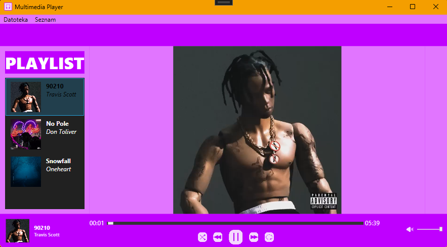

# 🎵 WPF Multimedia Player

A modern multimedia player built in **C# and WPF**, following the **MVVM design pattern**.  
It supports video playback, playlist management, editing media entries, dynamic volume control, and a clean neon-styled UI.

## 🎨 UI Preview


## ✨ Features

- 🎬 **Video playback** using WPF `MediaElement`
- 🎧 **Dynamic playlist** with Add / Edit / Remove functionality
- 🔁 **Loop**, 🔀 **Shuffle**, ⏮ **Previous**, ⏭ **Next** controls
- 🕹 **MVVM architecture** with `RelayCommand` and `INotifyPropertyChanged`
- 🖼 **Add & Edit windows** with file dialogs for media and cover image selection
- 🔊 **Volume control** with animated icon state (`Muted`, `Low`, `Mid`, `Full`)
- 💾 Persistent resources (videos & images included in the project)
- 🌙 **Custom theme** using magenta / dark color palette

## 🧠 Technologies Used

| Technology | Purpose |
|-------------|----------|
| **C# (.NET 8)** | Core application logic |
| **WPF (Windows Presentation Foundation)** | UI and bindings |
| **MVVM Pattern** | Data binding, command separation |
| **XAML** | Declarative UI markup |
| **OpenFileDialog** | File selection (videos & images) |
| **MediaElement** | Video playback engine |


## ⚙️ How to Run

1. Clone the repository:
   ```bash
   git clone https://github.com/<zanemersic>/multimedia-player.git
   ```

2. Open the solution in **Visual Studio 2022+**

3. Set the startup project to `MultimedijskiPredvajalnik`

4. Build and Run (`F5`)

Make sure that:
- Media files and images are marked as **Content → Copy Always**  
- Default video files are located under `Resources/`

## 📜 License

This project is open-source and available under the [MIT License](LICENSE).

